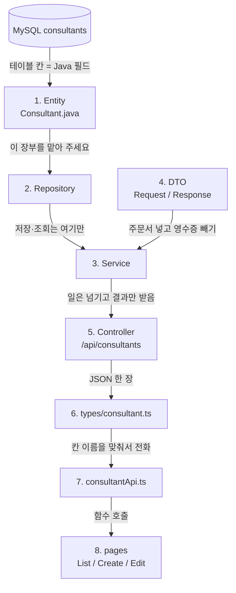

# CRUD 기초 단어장

| 항목 | 내용 |
|------|------|
| 이 문서 | 미션이 아니다. **이미 쓴 코드의 이름 사전**이다 |
| 범위 | 상품 · 고객 · 설계사 CRUD 에 실제로 등장한 것만 |
| 예시 | 기본은 설계사(`Consultant*`). 상품·고객에만 있는 것은 그 파일을 가리킨다 |
| 읽는 순서 | **항상 백엔드 → 프론트**. 요청(버튼 클릭)만 반대 방향이다 |
| 다음 할 일 | 이 책을 덮고 말할 수 있으면 `07_REST_CONTRACT_MISSION.md` |

새 테이블, 로그인, 검색, `@Valid` 는 여기에 없다. 코드에 아직 없기 때문이다.

---

## 0. 이 책을 여는 법

층(파일)을 설명할 때는 **항상 아래부터** 간다.

```
백엔드:  Entity → Repository → DTO → Service → Controller
   그다음 JSON 선
프론트:  types → api → pages
```

이게 우리가 코드를 만든 순서이고, 데이터가 DB 에서 화면으로 **올라오는** 순서이기도 하다.

예외는 하나다. **손님이 버튼을 누른 순간**이다. 그때만 요청이 화면에서 DB 로 **내려간다.** 그 그림에는 반드시 “요청(내려감)”이라고 적어 두었다.

각 단어는 이렇게 읽는다.

1. **한 줄** — 무슨 일을 하나
2. **아주 쉽게** — 초등학생에게 한 장면
3. **우리 코드** — 어느 파일, 어느 줄
4. **빼먹으면** — 그 한 줄이 없을 때 실제로 깨지는 것 (있을 때만)

라라벨·장고 칸은 층(파일 역할)에만 적는다.

---

## 1. 왜 건물이 둘인가

라라벨 Blade 를 오래 쓰면 이런 감각이 몸에 있다.

> 버튼을 누르면 서버가 **새 HTML 페이지**를 그려서 보낸다.

지금 프로젝트는 그렇게 하지 않는다. 건물이 **두 동**이다.

```
[브라우저]
      │
      │  처음 한 번만
      │  HTML + JS 통째로 받음
      │  (현관: frontend/index.html 의 #root)
      ▼
[React SPA]  http://localhost:5173
 frontend/
      │
      │  그다음부터는 페이지를 다시 안 받음
      │  데이터만 JSON 으로 주고받음
      │  axios  →  Content-Type: application/json
      ▼
[Spring Boot]  http://localhost:8080
 루트 src/
      │
      │  SQL 은 우리가 안 씀. JPA 가 Entity 를 보고 침
      ▼
[MySQL]  데이터베이스 이름 restapi_crud
```

- **5173** 은 화면 집이다. `frontend/` 에서 `npm run dev`.
- **8080** 은 API 집이다. 프로젝트 루트에서 `./gradlew bootRun`.
- 포트가 다르면 브라우저 눈에는 **다른 집(Origin)** 이다. 그래서 CORS 가 필요하다 (6장).
- Spring 은 HTML 을 안 내려준다. JSON 만 준다. 그림을 그리는 사람은 React 다.

이게 **SPA**(Single Page Application) 다. 현관으로 한 번 들어가고, 그 안에서 목록·등록·수정 방으로만 이사한다. 건물 전체(페이지 새로고침)는 안 무너진다.

라라벨로 말하면: Blade 뷰 대신 React. `routes/web.php` 의 HTML 라우트 대신 `App.tsx`. `routes/api.php` 자리가 Spring Controller.

장고로 말하면: 템플릿을 서버가 채우지 않는다. 뷰는 JSON 만 주고, 화면은 다른 프로세스(Vite)다.

---

## 2. 층을 쌓는 순서 — 백엔드에서 프론트로

이 장이 책의 **지도**다. 설계사 기준. 상품·고객은 상자 이름만 다르다.

상자 사이 글이 화살표의 뜻이다. “그냥 선”이 아니다.

```
[ MySQL ]
  테이블 이름: consultants
      │
      │  Entity 한 장 = 이 테이블의 칸 제목
      │  Java 이름 hireDate  ↔  DB 이름 hire_date
      │  앱을 켜면 ddl-auto=update 가 테이블을 맞춘다
      ▼
[ Entity ]  entity/Consultant.java
  금고 안 장부. 프론트에 그대로 안 준다.
      │
      │  "이 장부를 맡아 주세요"
      │  인터페이스만 적으면 스프링이 구현을 만든다
      │  JpaRepository<Consultant, Long>
      ▼
[ Repository ]  repository/ConsultantRepository.java
  save / findAll / findById / existsById / deleteById
      │
      │  Service 만 여기를 부른다
      │  Controller 는 냉장고에 손을 넣지 않는다
      ▼
[ Service ]  service/ConsultantService.java
  요리사. create · findAll · findById · update · delete
  Request 로 Entity 를 만들고, Entity 로 Response 를 만든다
      │
      │  들어올 때: JSON → Request DTO  (주문서, id 없음)
      │  나갈 때:   Entity → Response.from  (영수증, id 있음)
      ▼
[ DTO ]  dto/ConsultantRequest.java
         dto/ConsultantResponse.java
      │
      │  Controller 는 요리하지 않는다
      │  JSON 을 Request 로 받아 Service 에 넘기고
      │  Service 가 준 Response 를 HTTP 로 돌려준다
      ▼
[ Controller ]  controller/ConsultantController.java
  현관. /api/consultants
  POST · GET · PUT · DELETE
      │
      │  여기서부터는 다른 집이다 (8080 → 5173)
      │  오가는 것은 HTML 이 아니라 JSON
      │  CORS 가 "5173 집은 괜찮다"고 적혀 있어야 브라우저가 통과시킨다
      ▼
[ 프론트 타입 ]  frontend/src/types/consultant.ts
  백엔드 DTO 와 칸 이름을 맞춘 쌍둥이
  LocalDate → string   Long → number
      │
      │  axios 함수의 제네릭이 이 타입을 쓴다
      │  칸 이름이 한 글자라도 다르면 화면은 빈칸 (컴파일은 될 수 있음)
      ▼
[ 프론트 API ]  frontend/src/api/consultantApi.ts
                frontend/src/api/axios.ts  (baseURL = 8080)
  Controller 다섯 메서드와 1:1
      │
      │  페이지는 HTTP 를 직접 안 짠다
      │  getConsultants() 처럼 함수만 부른다
      ▼
[ 화면 ]  pages/ConsultantList.tsx
          pages/ConsultantCreate.tsx
          pages/ConsultantEdit.tsx
          App.tsx 가 URL 로 방을 연다
```

**이 화살표를 위에서 아래로 읽으면** “코드를 만든 순서”이자 “데이터가 DB 에서 화면으로 올라오는 골격”이다.

한 칸을 건너뛰면 안 된다.

- Controller 가 Repository 를 직접 부르면 홀 직원이 냉장고에 손을 넣는 것이다.
- 페이지가 Entity 를 직접 그리면 손님에게 금고 장부를 보여 주는 것이다.



식당으로 보면 역할이 고정이다. **표도 백엔드가 위**다.

| 순서 | 층 | 식당 | 설계사 파일 |
|------|----|------|-------------|
| 1 | Entity | 냉장고 칸 이름 | `Consultant.java` |
| 2 | Repository | 냉장고 담당 | `ConsultantRepository.java` |
| 3 | DTO | 주문서 / 영수증 | `ConsultantRequest` / `ConsultantResponse` |
| 4 | Service | 요리사 | `ConsultantService.java` |
| 5 | Controller | 홀 직원 | `ConsultantController.java` |
| 6 | 타입 | 신청서 칸 이름 | `types/consultant.ts` |
| 7 | API 함수 | 주문서 전달 | `consultantApi.ts` |
| 8 | 화면 | 손님의 방 | `ConsultantList` / `Create` / `Edit` |

---

## 3. 예외: 요청은 위에서 아래로 내려간다

2장은 **쌓는 순서**다. 손님이 “등록하기”를 누르는 순간만 방향이 반대다.

아래 그림의 화살표는 **요청이 내려가는 길**이다. 응답은 같은 길을 **거꾸로** 올라온다.

### 3-A. 등록 요청이 내려가는 길 (POST)

```
[화면 ConsultantCreate]
  이름·사번·전화를 useState 에 적어 둔다
      │
      │  제출 → e.preventDefault()   (안 하면 페이지 전체가 새로고침)
      │  빈 이름이면 return          (서버까지 안 감)
      │  body 를 만들고 createConsultant(body)
      ▼
[consultantApi.ts]
      │
      │  POST http://localhost:8080/api/consultants
      │  헤더 Content-Type: application/json
      │  두 번째 인자 data = body
      ▼
[ConsultantController.create]
      │
      │  @RequestBody 가 JSON 을 ConsultantRequest 로 옮김
      │  홀 직원은 요리 안 함. consultantService.create(request)
      ▼
[ConsultantService.create]
      │
      │  builder 로 Entity 조립 (id, createdAt 은 안 넣음)
      │  status 가 null 이면 "재직"
      │  repository.save → INSERT
      │  ConsultantResponse.from(saved) 로 영수증
      ▼
[consultants 테이블]
  새 행. DB 가 id 를 붙여 줌
```

응답이 올라오는 길:

```
테이블에 생긴 행 (id 포함)
      │  save 가 돌려준 Entity
      ▼
Service 가 Response.from
      │  장부 → 영수증
      ▼
Controller 가 201 + JSON
      │  "새로 만들었다"
      ▼
axios 의 response.data
      │
      ▼
화면 navigate('/consultants')
      목록 방으로 이사. 목록은 다시 GET 한다
```

### 3-B. 목록 (GET 여러 건)

요청은 화면이 열릴 때 **한 번** 내려간다. `useEffect(..., [])`.

```
[ConsultantList 가 처음 그려짐]
      │
      │  useEffect 의 [] = "이 방 첫 입장 때만"
      │  fetchConsultants() → getConsultants()
      ▼
GET /api/consultants
      │  body 없음. "명단 주세요"
      ▼
Controller.findAll → Service.findAll
      │
      │  repository.findAll  → Entity 리스트
      │  stream().map(from).collect  → Response 리스트
      ▼
200 + 배열 JSON
      │
      ▼
setConsultants(data)  → 표의 map 이 행을 그림
```

데이터가 없으면 `consultants.length === 0` 안내 문구. 실패하면 `catch` → 빨간 글자. 기다리는 동안 `loading`.

### 3-C. 수정 (GET 한 건, 그다음 PUT)

수정은 요청이 **두 번**이다. 먼저 읽어 오고, 고쳐서 다시 넣는다.

```
주소 /consultants/3/edit
      │
      │  useParams 의 id 는 문자열 "3"
      │  Number(id) 로 숫자 3
      │  getConsultant(3)
      ▼
GET /api/consultants/3
      │  URL 의 3 = 누구를 볼지
      ▼
Service.findById
      │  없으면 orElseThrow
      │  있으면 from → Response
      ▼
200 JSON → setName, setHireDate, ...
      달력 칸에는 null 을 넣지 못함. hireDate ?? ''
```

저장 버튼:

```
handleSubmit
      │  preventDefault, body 작성
      │  updateConsultant(3, body)
      ▼
PUT /api/consultants/3
      │  URL 의 3 = 누구를 고칠지
      │  body    = 무엇으로 고칠지
      ▼
Service.update
      │  findById 로 기존 행
      │  setName, setPhone, setHireDate ... 한 칸씩 덮기
      │  setHireDate 를 빼먹으면 그 칸만 안 바뀜  ← 우리가 겪음
      │  @Transactional 이 끝나면 더티 체킹이 UPDATE
      ▼
200 JSON → navigate('/consultants')
```

### 3-D. 삭제 (DELETE)

```
목록의 삭제 버튼
      │
      │  window.confirm 에서 취소면 return (서버 안 감)
      │  deleteConsultant(id)
      ▼
DELETE /api/consultants/{id}
      │  body 없음
      ▼
Service.delete
      │  existsById 가 false 면 예외
      │  true 면 deleteById
      ▼
204  본문 없음
      │
      │  표만 지우면 새로고침 때 행이 다시 산다
      │  그래서 fetchConsultants() 로 다시 GET
      ▼
목록이 DB 와 같아짐
```

---

## 4. 파일 짝 (세 자원이 같은 모양)

층과 함수 이름은 세 번 같다. 다른 것은 칸(필드)뿐이다.

| 할 일 | 상품 | 고객 | 설계사 |
|-------|------|------|--------|
| Entity | `InsuranceProduct` | `Customer` | `Consultant` |
| 테이블 | `insurance_products` | `customers` | `consultants` |
| Repository | `InsuranceProductRepository` | `CustomerRepository` | `ConsultantRepository` |
| Request | `InsuranceProductRequest` | `CustomerRequest` | `ConsultantRequest` |
| Response | `InsuranceProductResponse` | `CustomerResponse` | `ConsultantResponse` |
| Service | `InsuranceProductService` | `CustomerService` | `ConsultantService` |
| Controller | `InsuranceProductController` | `CustomerController` | `ConsultantController` |
| API 경로 | `/api/insurance-products` | `/api/customers` | `/api/consultants` |
| TS 타입 | `insuranceProduct.ts` | `customer.ts` | `consultant.ts` |
| axios | `insuranceProductApi.ts` | `customerApi.ts` | `consultantApi.ts` |
| 화면 경로 | `/`, `/products/new`, `/products/:id/edit` | `/customers` … | `/consultants` … |

고객 파일을 복사해 이름만 바꾸면 안 되는 이유: 설계사에게는 사번·고용날짜·재직이 있고, 고객의 생일·주소가 없다.

---

## 5. HTTP · REST · JSON

백엔드 Controller 가 바깥과 약속하는 말들이다. 프론트 axios 도 **같은 약속**을 지킨다.

### CRUD 와 HTTP 짝

Create / Read / Update / Delete.

| 동작 | HTTP | 설계사 URL | 성공 코드 | 본문 |
|------|------|------------|-----------|------|
| 등록 | POST | `/api/consultants` | **201** | 만든 설계사 JSON |
| 목록 | GET | `/api/consultants` | **200** | 배열 JSON |
| 단건 | GET | `/api/consultants/{id}` | **200** | 한 명 JSON |
| 수정 | PUT | `/api/consultants/{id}` | **200** | 고친 JSON |
| 삭제 | DELETE | `/api/consultants/{id}` | **204** | 없음 |

고객은 `/api/customers`, 상품은 `/api/insurance-products`. 동사와 코드는 같다.

**REST API**  
주소와 HTTP 메서드로 “무엇을 하라”고 약속하는 방식. 화면 HTML 이 아니라 JSON 을 주고받는다.

아주 쉽게: 우체국에 “새 사람 등록”은 POST, “명단 주세요”는 GET, “3번을 이 내용으로”는 PUT, “3번 빼 주세요”는 DELETE.

**JSON**  
중괄호로 된 데이터 글자. 키 이름은 Java 필드와 같게 **camelCase**. `employeeCode`, `hireDate`. 서버가 `employeeCode` 인데 프론트가 `code` 로 읽으면 화면만 빈칸이다.

**Request Body**  
POST/PUT 때 봉투 안에 넣는 JSON. 등록 화면의 `body` 와 Postman 의 Body 가 같다. GET/DELETE 는 보통 body 가 없다.

**Path variable**  
URL 안의 `{id}`. `/api/consultants/3` 의 `3` 은 “누구”이고, body 는 “무엇으로”다. 수정은 이 둘이 나뉜다.

**Content-Type: application/json**  
“이 봉투 안에 JSON 이 있다”는 스티커. `frontend/src/api/axios.ts` 에 이미 있다. 빼면 Spring 이 body 를 못 읽어 Request 가 비거나 실패한다.

**상태 코드**

| 코드 | 뜻 | 우리 코드 | 언제 |
|------|----|-----------|------|
| 200 | 성공, 내용 있음 | `ResponseEntity.ok(...)` | 목록, 단건, 수정 |
| 201 | 새로 만듦 | `HttpStatus.CREATED` | 등록만 |
| 204 | 성공, 내용 없음 | `ResponseEntity.noContent().build()` | 삭제 |

200 으로 등록해도 동작은 한다. REST 관례상 생성은 201 을 쓴다. “이미 있던 것을 준 것”과 “방금 태어난 것”을 숫자로 구별한다.

없는 id 는 지금 `IllegalArgumentException` 이라 브라우저에는 5xx 처럼 보인다. 예쁜 404 JSON 은 아직 없다 (`07` 의 일).

---

## 6. 백엔드가 켜지는 곳

프론트보다 먼저, 서버 전원을 본다.

### `@SpringBootApplication` / `main`

한 줄: 스프링 앱의 전원 버튼.

아주 쉽게: 이 버튼을 누르면 식당 문·주방·냉장고가 같이 열린다. Controller, Service, Entity 를 우리가 `new` 하지 않아도 스프링이 찾아 등록한다.

우리 코드: `RestapiCrudApplication.java` 의 `SpringApplication.run(...)`.

### `build.gradle` 에서 우리가 쓰는 것만

| 의존성 | 하는 일 |
|--------|---------|
| `spring-boot-starter-webmvc` | HTTP, Controller, JSON(Jackson) |
| `spring-boot-starter-data-jpa` | Entity, Repository, DB 연결 |
| `lombok` | getter/setter/생성자/빌더를 컴파일 때 대신 씀 |
| `mysql-connector-j` | MySQL 드라이버 |
| `devtools` | 개발 중 코드 바꾸면 재시작 도우미 |

검증 starter, Security 는 **아직 없다.** `07` 과 로그인 단계의 재료다.

Jackson 은 import 하지 않아도 `@RequestBody` 가 JSON 을 객체로 바꾼다. webmvc 스타터 안에 들어 있다.

### `application.properties`

아주 쉽게: 식당 주소와 냉장고 열쇠가 적힌 메모.

| 키 | 한 줄 |
|----|--------|
| `spring.datasource.url` | 어느 MySQL, 어느 DB(`restapi_crud`) |
| `username` / `password` | DB 로그인 |
| `driver-class-name` | MySQL 드라이버 클래스 |
| `spring.jpa.hibernate.ddl-auto=update` | Entity 를 보고 테이블을 만들거나 맞춤. `CREATE TABLE` 을 손으로 안 씀 |
| `show-sql` / `format_sql` | 실행 SQL 을 콘솔에 예쁘게. 학습할 때 “지금 INSERT 됐나”를 눈으로 확인 |
| `hibernate.dialect` | MySQL 말투로 SQL 생성 |

`ddl-auto=update` 는 연습용이다. Entity 에 칸을 추가하면 컬럼이 생긴다. 칸을 지워도 컬럼이 자동으로 안 지워질 수 있다. 지금은 “테이블을 손으로 안 만든다”만 알면 된다.

---

## 7. CORS — 두 동이 대화하게

파일: `config/WebConfig.java`

**Origin**  
주소의 “누구 집인가”. 프로토콜 + 호스트 + 포트.  
`http://localhost:5173` 과 `http://localhost:8080` 은 포트가 달라서 **다른 집**이다.

**CORS**  
브라우저가 “다른 집 API 를 부르면 위험할 수 있다”고 막을 때, **서버가** “그 집은 괜찮아”라고 적어 주는 설정.

아주 쉽게: 5173 손님이 8080 주방에 말을 걸 수 있는 출입증. 출입증은 **백엔드에** 붙인다. 프론트에 붙이는 게 아니다.

| 이름 | 한 줄 |
|------|--------|
| `@Configuration` | 이 클래스는 설정이다. 스프링이 켜질 때 읽는다 |
| `WebMvcConfigurer` | 웹 설정에 끼어들 수 있는 인터페이스 |
| `addCorsMappings` | 어떤 URL 에 CORS 를 열지 |
| `addMapping("/**")` | 모든 경로 |
| `allowedOrigins("http://localhost:5173")` | 이 프론트만 허용 |
| `allowedMethods("GET","POST","PUT","DELETE")` | 우리가 쓰는 네 동사 |
| `allowedHeaders("*")` | 헤더 제한 없음 (`Content-Type` 포함) |
| `allowCredentials(true)` | 쿠키를 실을 수 있게. 지금은 로그인 전이라 거의 안 쓰임 |
| `maxAge(3600)` | 브라우저가 미리보기(preflight) 결과를 1시간 기억 |

CORS 를 안 열면 **React 만** 빨간 에러를 본다. Postman 은 브라우저가 아니라서 CORS 와 상관없다. “Postman 은 되는데 화면만 안 되면” 먼저 CORS 를 의심한다.

---

## 8. Entity — 테이블 설계도 (백엔드 1층)

파일: `entity/Consultant.java`  
같은 패턴: `Customer.java`, `InsuranceProduct.java`

라라벨 짝: Eloquent Model + `$table`. 장고 짝: `models.Model`.

한 줄: DB 테이블 한 개와 짝이 되는 Java 클래스. 필드 하나 ≈ 컬럼 하나.

아주 쉽게: 출석부의 **칸 제목**이다. 이름, 사번, 전화… 실제 사람 명단(행)은 아직 없고, “어떤 칸이 있나”만 적혀 있다.

프론트에 Entity 를 그대로 안 주는 이유: 금고 안 장부이기 때문이다. 손님에게는 영수증(Response DTO)을 준다. 지금은 숨길 비밀번호가 없어도, “장부 그대로 안 준다” 습관을 유지한다.

### 클래스에 붙는 표시

**`@Entity`**  
이 클래스는 JPA 가 관리하는 테이블 짝이다.

**`@Table(name = "consultants")`**  
실제 테이블 이름. Java 클래스 이름과 다를 수 있어서 명시한다.

**`@Getter` / `@Setter` (롬복)**  
`getName()`, `setName()` 을 손으로 안 짠다. Service 의 `request.getName()`, `consultant.setHireDate(...)` 가 여기서 생긴다. Setter 가 없으면 수정이 불가능하다.

**`@NoArgsConstructor`**  
인자 없는 생성자. **JPA 필수.** JPA 는 빈 객체를 만든 뒤 컬럼 값을 채워 넣는다. 없으면 조회가 깨질 수 있다.

**`@AllArgsConstructor`**  
모든 필드를 한 번에 받는 생성자. 주로 롬복 `@Builder` 가 내부에서 쓴다.

**`@Builder`**  
`Consultant.builder().name("박설계").phone("010-...").build()`  
아주 쉽게: 레고처럼 필요한 칸만 골라 조립. `create` 가 이 방식으로 Entity 를 만든다. id 와 createdAt 은 조립에 안 넣는다. DB 가 채운다.

### 필드에 붙는 표시

**`@Id` + `@GeneratedValue(strategy = GenerationType.IDENTITY)`**  
기본키. IDENTITY = MySQL `AUTO_INCREMENT`. 우리가 id 를 안 넣어도 1, 2, 3… 이 붙는다.

**`@Column`**  
이 필드가 컬럼이다.

| 속성 | 한 줄 | 우리 코드 |
|------|--------|-----------|
| `nullable = false` | NOT NULL | `name`, `phone`, `employeeCode` |
| `length = 50` | VARCHAR(50) | `name` |
| `name = "hire_date"` | Java `hireDate` ↔ DB `hire_date` | camelCase ↔ snake_case |
| `updatable = false` | 수정해도 이 컬럼은 안 바뀜 | `created_at` |
| `precision` / `scale` | 숫자 자릿수 | 상품 `monthlyPremium` (10자리, 소수 0) |
| `columnDefinition = "TEXT"` | MySQL TEXT | 상품 `description` |

`name = "hire_date"` 를 빼면, 설정에 따라 컬럼 이름이 `hireDate` 로 생길 수 있다. Java 는 낙타, DB 는 뱀. `@Column(name = ...)` 으로 잇는다. `employee_code`, `birth_date`, `monthly_premium` 도 같다.

**`@CreationTimestamp` / `@UpdateTimestamp`**  
첫 INSERT 때 `createdAt`, 저장·수정 때마다 `updatedAt`. Service 가 시계를 안 넣는다.

**`@Builder.Default`**  
`builder()` 로 만들 때도 필드 기본값을 지킨다. 고객 `status = "활성"`, 상품 `"판매중"` 에 붙어 있다.

설계사 `status = "재직"` 은 필드 기본값은 있지만 `@Builder.Default` 는 없다. 그래서 `create` 에서 Service 가 직접 `request.getStatus() != null ? ... : "재직"` 을 넣는다. 같은 “기본 상태”인데 구현 자리가 조금 다르다.

### 타입

| Java | 언제 | JSON 에서 |
|------|------|-----------|
| `Long` | id | 숫자 |
| `String` | 이름, 전화, 상태 | 문자열 |
| `LocalDate` | 날짜만 (고용날짜, 생일) | `"2020-03-01"` |
| `LocalDateTime` | 시분초 (createdAt) | ISO 문자열 |
| `BigDecimal` | 돈 (월 보험료) | 숫자. `float`/`double` 오차 방지 |

아주 쉽게: 날짜만 필요하면 달력(`LocalDate`), 몇 시에 저장됐는지는 시계(`LocalDateTime`), 돈은 저울(`BigDecimal`).

프론트 `input type="date"` 의 값은 이미 `"YYYY-MM-DD"` 문자열이라 `LocalDate` 와 맞는다. Spring 이 JSON 문자열을 `LocalDate` 로 바꿔 준다.

---

## 9. Repository — 냉장고 담당 (백엔드 2층)

파일: `repository/ConsultantRepository.java`

```java
public interface ConsultantRepository extends JpaRepository<Consultant, Long> {
}
```

한 줄: 몸통 없는 인터페이스인데, 저장·조회·삭제가 생긴다.

아주 쉽게: “이 출석부 담당해 주세요”라고만 적으면 스프링이 선생님을 배치한다. SQL 을 우리가 안 쓴다. 빈 인터페이스인데 동작하는 것이 정상이다.

라라벨 짝: `Consultant::query()->find()`, `->save()`. 장고 짝: `objects.get()`, `save()`.

`JpaRepository<엔티티, 기본키타입>`

- 첫 칸: 다루는 장부가 `Consultant`
- 둘째 칸: id 가 `Long` 이므로 `Long`

우리가 **실제로 부르는** 메서드:

| 메서드 | 한 줄 | 누가 부르나 |
|--------|--------|-------------|
| `save(entity)` | 새 행이면 INSERT. 저장 후 id 가 채워진 Entity 를 돌려줌 | `create` |
| `findAll()` | 전부 가져오기 | `findAll` |
| `findById(id)` | 한 행. 없으면 빈 상자(`Optional`) | `findById`, `update` |
| `existsById(id)` | 있냐 없냐 (true/false) | `delete` |
| `deleteById(id)` | 그 행 지우기 | `delete` |

`save` 주석에 “기존이면 UPDATE”라고 상품 Service 에 적혀 있다. 우리 `update` 는 `save` 를 안 부르고 setter + 더티 체킹을 쓴다. 둘 다 UPDATE 가 될 수 있지만, **지금 수정 코드가 쓰는 길은 더티 체킹**이다.

검색 메서드(`findByName`) 는 인터페이스에 **아직 없다.** `07` 의 일이다.

---

## 10. DTO — 주문서와 영수증 (백엔드 3층)

Entity 는 금고 안 장부다. 손님에게는 영수증을 준다.

| 종류 | 방향 | id / createdAt | 설계사 파일 |
|------|------|----------------|-------------|
| Request | 클라이언트 → 서버 | **없음** | `ConsultantRequest` |
| Response | 서버 → 클라이언트 | **있음** | `ConsultantResponse` |

아주 쉽게: 신청서(Request)에는 아직 번호가 없다. 접수 도장을 찍은 뒤의 영수증(Response)에 번호와 접수 시각이 있다.

Request 에 id 가 없는 이유: id 는 DB 가 붙인다. 손님이 번호를 들고 오면 안 된다.  
Response 에 id 가 있는 이유: 목록·수정·삭제가 “몇 번인지” 알아야 한다.

### Request 의 롬복

`@Getter @Setter @NoArgsConstructor @AllArgsConstructor @Builder`

**`@NoArgsConstructor` 가 Request 에 필요한 이유**  
JSON 을 객체로 만들 때 스프링(Jackson)이 빈 객체를 만든 뒤 setter 로 칸을 채운다. 빈 생성자가 없으면 `@RequestBody` 가 실패할 수 있다.

JSON 키는 Java 필드 이름과 같다. `"hireDate": "2020-03-01"` → `LocalDate hireDate`.

### `from(entity)`

```java
public static ConsultantResponse from(Consultant consultant) {
    return ConsultantResponse.builder()
        .id(consultant.getId())
        .name(consultant.getName())
        // ...
        .hireDate(consultant.getHireDate())
        .build();
}
```

한 줄: Entity → Response 변환을 한곳에 모은다.

아주 쉽게: 장부를 보고 영수증을 베끼는 도장. create / findAll / findById / update 가 모두 `ConsultantResponse.from(...)` 을 쓴다. 칸을 빼먹으면 그 칸만 JSON 에 안 나간다.

`public static` 인 이유: 객체를 미리 안 만들어도 `ConsultantResponse.from(saved)` 로 바로 부른다.

---

## 11. Service — 요리사 (백엔드 4층)

파일: `service/ConsultantService.java`

라라벨 짝: Controller 가 마른 뒤의 Action/Service.  
장고 짝: 뷰가 직접 Model 을 만지지 않게 모은 곳.

한 줄: 등록·조회·수정·삭제의 **실제 일**. Controller 는 여기만 부른다.

### 클래스 표시

**`@Service`**  
스프링이 이 클래스를 빈(Bean)으로 등록한다. 아주 쉽게: 요리사 명찰. 명찰이 있어야 홀 직원이 “주방 사람”을 찾을 수 있다.

**빈(Bean)**  
스프링이 만들어 두고 여기저기 넣어 주는 객체. 우리가 `new ConsultantService()` 하지 않는다.

**`@RequiredArgsConstructor` + `private final ConsultantRepository ...`**  
`final` 필드용 생성자를 롬복이 만든다. 스프링이 그 생성자로 Repository 를 넣는다. 이게 **생성자 주입**이다.

아주 쉽게: 주방이 문을 열 때 냉장고 열쇠를 받는다. 열쇠를 주방이 직접 깎지 않는다.

**`@Transactional`**  
메서드 안 DB 일을 한 묶음으로 본다. 중간에 예외가 나면 롤백(일부만 저장되는 사고 방지). `update` 의 더티 체킹도 이 묶음이 끝날 때 UPDATE 가 나간다.

아주 쉽게: 주문 하나가 실패하면 냄비 전부를 비운다.

### 메서드 다섯 개 (세 자원 공통)

| 메서드 | 한 줄 |
|--------|--------|
| `create` | Request → Entity → `save` → Response |
| `findAll` | `findAll` → 각각 `from` → List |
| `findById` | 있으면 Response, 없으면 예외 |
| `update` | 찾아서 setter 로 덮기 → Response |
| `delete` | 없으면 예외, 있으면 `deleteById` |

`create` 에서 **넣지 않는 것**: `id`, `createdAt`, `updatedAt`. DB/JPA 가 채운다.

### `create` 를 천천히

```java
Consultant consultant = Consultant.builder()
    .name(request.getName())
    .employeeCode(request.getEmployeeCode())
    .phone(request.getPhone())
    .email(request.getEmail())
    .hireDate(request.getHireDate())
    .status(request.getStatus() != null ? request.getStatus() : "재직")
    .build();
Consultant saved = consultantRepository.save(consultant);
return ConsultantResponse.from(saved);
```

1. 주문서(Request) 칸을 장부(Entity) 칸에 옮긴다.  
2. 상태를 안 보내면 `"재직"` (상품 `"판매중"`, 고객 `"활성"`).  
3. `save` = INSERT. `saved` 에는 DB 가 준 id 가 들어 있다.  
4. 장부를 영수증으로 바꿔 Controller 에 돌려준다.

### `stream().map(...).collect(...)`

```java
return consultantRepository.findAll()
    .stream()
    .map(ConsultantResponse::from)
    .collect(Collectors.toList());
```

한 줄: 리스트의 각 엔티티를 영수증으로 바꿔 다시 리스트로 모은다.

아주 쉽게: 장부 더미를 한 장씩 영수증으로 복사해 새 더미를 만든다. 장부 더미를 그대로 현관에 내놓지 않는다.

`ConsultantResponse::from` 은 `c -> ConsultantResponse.from(c)` 와 같다. **메서드 참조.**

### `Optional` / `orElseThrow`

`findById` 는 “있을 수도 없을 수도 있는 상자”를 준다.

```java
consultantRepository.findById(id)
    .orElseThrow(() -> new IllegalArgumentException("해당 직원이 없습니다. id" + id));
```

상자 안에 있으면 꺼내고, 비었으면 예외. 학습 단계는 `IllegalArgumentException`. 브라우저에는 5xx 처럼 보인다. 404 JSON 은 아직 아님.

### 더티 체킹 (Dirty Checking) — `update` 의 핵심

`@Transactional` 안에서 이미 불러 온 Entity 의 칸을 setter 로 바꾸면, 메서드가 끝날 때 JPA 가 **바뀐 칸만** UPDATE 한다. `save()` 를 다시 안 불러도 된다.

아주 쉽게: 출석부 칸을 고치면, 선생님이 수업 끝에 고친 칸만 다시 적는다. **고친다고 손대지 않은 칸은 다시 안 적는다.**

그래서 `consultant.setHireDate(request.getHireDate())` 가 없으면, PUT JSON 에 날짜가 있어도 DB 의 `hire_date` 는 그대로다. 이름·상태는 바뀌고 고용날짜만 안 바뀌던 이유가 이것이다.

`update` 가 덮는 설계사 칸: `name`, `email`, `employeeCode`, `phone`, `hireDate`.  
`status` 만 예외로, null 이면 기존 유지.

```java
if (request.getStatus() != null) {
    consultant.setStatus(request.getStatus());
}
```

화면의 select 는 보통 항상 문자열을 보내므로, 수정 화면에서는 status 도 거의 항상 바뀐다.

### `delete`

```java
if (!consultantRepository.existsById(id)) {
    throw new IllegalArgumentException(...);
}
consultantRepository.deleteById(id);
```

없는 번호를 지우라고 하면 예외. 있으면 삭제. 반환 값이 없다(`void`). Controller 가 204 를 붙인다.

---

## 12. Controller — 현관 (백엔드 5층, JSON 의 문)

파일: `controller/ConsultantController.java`

라라벨 짝: `Route::prefix('api/consultants')` + Controller. 장고 짝: `urls.py` + 뷰가 JSON 을 줄 때.

한 줄: URL + HTTP 메서드를 Java 메서드에 연결한다. 요리하지 않는다.

아주 쉽게: 현관 안내판. “새로 등록은 이 문으로 POST.” 안내판은 냉장고에 손을 넣지 않는다.

### 클래스 표시

**`@RestController`**  
HTML 뷰가 아니라 JSON 입구. (`@Controller` + 반환값을 JSON 으로)

**`@RequestMapping("/api/consultants")`**  
이 클래스의 공통 주소 앞부분. 메서드의 `@GetMapping("/{id}")` 와 합쳐져 `GET /api/consultants/3` 이 된다.

**`@RequiredArgsConstructor` + `private final ConsultantService`**  
Service 만 주입. 이 파일에 `ConsultantRepository` import 가 없어야 한다.

### HTTP 메서드 표시

| 이름 | HTTP | 우리 메서드 |
|------|------|-------------|
| `@PostMapping` | POST | `create` |
| `@GetMapping` | GET 목록 | `findAll` |
| `@GetMapping("/{id}")` | GET 단건 | `findById` |
| `@PutMapping("/{id}")` | PUT | `update` |
| `@DeleteMapping("/{id}")` | DELETE | `delete` |

같은 클래스에 `@GetMapping` 이 둘이다. 하나는 경로 없음(목록), 하나는 `"/{id}"`(한 명). 스프링이 URL 모양으로 고른다.

### 매개변수

**`@RequestBody ConsultantRequest request`**  
JSON 몸통 → Request 객체. 우체부가 봉투를 신청서 칸에 옮겨 적는 일. POST/PUT 에 있다. GET/DELETE 에는 없다.

**`@PathVariable Long id`**  
URL 의 `{id}` → 변수. 문패 숫자. “누구”를 가리킨다.

### `ResponseEntity`

상태 코드 + 본문을 같이 돌려주는 상자.

| 호출 | 결과 |
|------|------|
| `ResponseEntity.status(HttpStatus.CREATED).body(response)` | 201 + JSON |
| `ResponseEntity.ok(...)` | 200 + JSON |
| `ResponseEntity.noContent().build()` | 204, 본문 없음 |

삭제 반환 타입은 `ResponseEntity<Void>`. “성공했지만 줄 내용 없음.” 프론트 `deleteConsultant` 가 `Promise<void>` 인 이유와 짝이다.

### `MainController`

`GET /test` → `"Hello World"`. CRUD 와 무관한 서버 생존 확인용.

여기까지가 백엔드다. 이제 같은 약속을 프론트가 받는다.

---

## 13. 프론트 타입 — DTO 의 쌍둥이 (프론트 1층)

파일: `frontend/src/types/consultant.ts`

한 줄: 백엔드 Request/Response 와 **칸 이름을 맞춘** TypeScript 모양.

아주 쉽게: 서버가 보낸 영수증 칸 이름과, 프론트가 읽으려는 칸 이름이 같아야 한다.

| Java | TypeScript |
|------|------------|
| `String` | `string` |
| `Long` | `number` |
| `LocalDate` / `LocalDateTime` | `string` (JSON 이 문자열이라서) |
| null 가능 | `string \| null` 또는 `?` |

**`export interface ConsultantRequest`**  
등록/수정 때 보내는 몸통. id 없음.

**`export interface ConsultantResponse`**  
서버가 돌려주는 몸통. `id`, `createdAt`, `updatedAt` 있음.

**`email?: string`**  
`?` = 선택. 등록 때 이메일을 안 넣을 수 있다.

**`hireDate: string | null` (Response)**  
서버가 날짜를 안 채워 두었으면 `null`. 목록에서 `consultant.hireDate ?? '-'` 로 빈 칸을 `-` 로 보여 준다.

**`import type { ... }`**  
타입만 가져온다. 실행 코드가 아니다. 화면이 더 무거워지지 않는다.

빼먹으면: 서버는 `employeeCode` 인데 프론트 타입에 `code` 만 있으면, 빨간 줄이 안 날 수도 있고, 표의 사번 칸은 비어 있다.

---

## 14. 프론트 API — Controller 와 1:1 (프론트 2층)

파일: `frontend/src/api/axios.ts`, `consultantApi.ts`

### `axios.ts`

```ts
const api = axios.create({
    baseURL: 'http://localhost:8080',
    headers: { 'Content-Type': 'application/json' },
});
```

한 줄: 모든 API 호출이 쓰는 **공용 전화기**. 주소를 호출마다 반복하지 않는다.

아주 쉽게: 8080 집으로 거는 단축 번호. 헤더에 “JSON 입니다” 스티커가 이미 붙어 있다.

새 axios 인스턴스를 페이지마다 만들지 않는다. 상품·고객·설계사 API 파일이 이 `api` 하나를 import 한다.

### `consultantApi.ts`

경로 앞 `/` 가 필수. `baseURL` 이 `http://localhost:8080` 일 때:

- `'/api/consultants'` → `http://localhost:8080/api/consultants` (맞음)
- `'api/consultants'` → 상대경로가 꼬일 수 있음 (상품 때 겪었던 실수)

| 프론트 함수 | HTTP | 백엔드 |
|-------------|------|--------|
| `getConsultants` | GET `/api/consultants` | `findAll` |
| `getConsultant(id)` | GET `/api/consultants/{id}` | `findById` |
| `createConsultant(data)` | POST + body | `create` |
| `updateConsultant(id, data)` | PUT + body | `update` |
| `deleteConsultant(id)` | DELETE | `delete` |

**`api.get<ConsultantResponse[]>(경로)`**  
제네릭: “이 JSON 은 이 모양이다”라고 TypeScript 에 알려 준다.

**`response.data`**  
axios 가 주는 껍데기가 아니라, 실제 JSON 본문. 목록이면 배열, 단건이면 객체.

**`Promise<T>` + `async` / `await`**  
“나중에 T 가 온다”는 약속. `await` 는 그 약속이 끝날 때까지 이 함수만 잠시 기다린다. 화면 전체가 멈추는 새로고침이 아니다.

**백틱** `` `/api/consultants/${id}` ``  
문자열 안에 변수 넣기. id 가 3 이면 `/api/consultants/3`.

**`Promise<void>` (삭제)**  
204 라 읽을 body 가 없다. `response.data` 를 안 쓴다.

페이지는 `fetch('http://localhost:8080/...')` 를 직접 안 짠다. 항상 이 함수들을 부른다. HTTP 실수는 API 파일 한곳에서 고친다.

---

## 15. 프론트 화면 — 방 세 개 (프론트 3층)

화면은 백엔드가 준 JSON 을 **그리는** 곳이다. 테이블을 직접 만지지 않는다.

### 앱이 켜지는 곳

| 이름 | 한 줄 |
|------|--------|
| Vite | 프론트 개발 서버. 기본 포트 5173 |
| `npm run dev` | 그 서버를 켠다 |
| `index.html` 의 `#root` | React 가 그릴 빈 칸 |
| `main.tsx` 의 `createRoot(...).render` | `#root` 에 `App` 을 붙인다 |
| `StrictMode` | 개발 중 검사를 한 겹 더 |

아주 쉽게: HTML 은 빈 액자고, React 가 그림을 그린다. 라라벨처럼 서버가 HTML 칸을 채우지 않는다.

### 라우터 (`App.tsx`)

| 이름 | 한 줄 | 라라벨 짝 |
|------|--------|-----------|
| `BrowserRouter` | 주소창을 보고 화면을 바꾸게 감싼다 | 라우트가 켜진 상태 |
| `Routes` | 아래 규칙 중 하나에 맞춰라 | Route 목록 |
| `Route path= element=` | 이 주소면 이 화면 | `Route::get('/consultants', ...)` |
| `:id` | 자리 표시자 | `{id}` |
| `new` 를 `:id` **위**에 | `new` 는 이름이이지 숫자가 아님 | `create` 라우트를 `{id}` 보다 먼저 |

`Link` 는 `<a>` 와 비슷하지만 **전체 새로고침 없이** 방만 바꾼다. SPA 의 이사다.

빼먹으면: `/consultants/new` 가 `:id` 규칙에 먹혀 `id = "new"` 가 될 수 있다.

### 훅 — 화면이 기억하는 방법

**함수 컴포넌트**  
`function ConsultantList() { return ... }` 가 방 하나다.

**`useState(초기값)`**  
`const [name, setName] = useState('')`  
값이 바뀌면 그 방만 다시 그린다. 아주 쉽게: 칠판과 분필. `value={name}` 으로 칠판을 보여 주고, `onChange` 로 분필을 움직인다.

**`useState<ConsultantResponse[]>([])`**  
이 칠판은 설계사 배열이다. 처음엔 빈 명단.

**`useEffect(함수, [])`**  
방이 **처음 나타날 때** 한 번. 목록이 GET 하는 자리.  
아주 쉽게: 명단 방에 들어오면 출석부를 한 번 가져온다. `[]` 가 없으면 그릴 때마다 가져와 무한 반복할 수 있다.

**`useEffect(함수, [id, consultantId])`**  
수정 방. 문패(id)가 바뀌면 다른 사람을 다시 GET 한다.

`useEffect` 안에 `async` 를 바로 쓰지 않는다. `ConsultantEdit` 처럼 안쪽 함수 `load` 를 만든 뒤 `load()` 한다.

**`useParams()`**  
URL 의 `:id`. **문자열** `"3"` 이다. API 는 숫자를 받으므로 `Number(id)`. 이상하면 `Number.isNaN` 으로 거른다.

**`useNavigate()`**  
코드로 다른 주소로 이동. 등록/수정 성공 후 `navigate('/consultants')`. 라라벨 `redirect` 의 자리. HTML 전체가 다시 내려오지 않는다.

### 폼 (제어 컴포넌트)

입력칸에 보이는 글자 = React 가 아는 값.

```
타이핑
   │  onChange → setName(e.target.value)
   ▼
useState 의 name 이 바뀜
   │  value={name} 으로 다시 그림
   ▼
제출
   │  e.preventDefault()   ← 없으면 SPA 가 통째로 새로고침
   │  body = { name: name.trim(), ... }
   ▼
createConsultant(body) 또는 updateConsultant
```

**`trim()`**  
앞뒤 공백 제거. `" 박설계 "` 가 그대로 저장되지 않게.

**`disabled={saving}` / `disabled={loading}`**  
저장 중 버튼을 잠근다. 두 번 눌러 POST 가 두 번 나가는 것을 줄인다.

**`type="date"`**  
달력. 값은 문자열 `"YYYY-MM-DD"`. Java `LocalDate` 와 맞다. `value={hireDate}` 에 `null` 을 넣지 않는다. `?? ''`.

**`<select>`**  
상태. 설계사는 재직/휴직/퇴직. 초기값을 `'재직'` 으로 두면 칸이 비어 보이지 않는다.

**`type="submit"` vs `type="button"`**  
등록/저장은 submit (폼의 `onSubmit`). 삭제는 폼 제출이 아니므로 `type="button"`.

### 빈 값 보내기 (등록과 수정이 다름)

등록 (`ConsultantCreate`):

```ts
hireDate: hireDate.trim() || undefined,
email: email.trim() || undefined,
```

빈 문자열이면 필드 자체를 안 보낸다. 서버는 null 로 받는다. 선택 칸의 약속이다.

수정 (`ConsultantEdit`) 은 `hireDate: hireDate.trim()` 이라 **빈 칸도 문자열로 보낸다.** 등록과 다르다. 빈 날짜 PUT 이 실패하면 여기와 Jackson 의 `LocalDate` 변환을 의심한다.

### 목록이 나누는 네 갈래

1. `loading` → “로딩 중...”  
2. `error` → 빨간 글자 (`try/catch`, `console.error` 는 개발자 도구용)  
3. `consultants.length === 0` → “등록된 설계사 없습니다.”  
4. 그 외 → `map` 으로 표

**`key={consultant.id}`**  
React 가 행을 구분하는 이름표. 없으면 경고가 나고, 행이 꼬일 수 있다.

**`window.confirm`**  
“정말 지울까요?” 취소면 서버를 안 부른다.

**`hireDate ?? '-'`**  
null/undefined 면 `-`. `||` 와 달리 `0` 이나 `''` 를 무조건 대체하지 않고, “없음”만 본다.

**`{error && <div>...</div>}`**  
error 가 있을 때만 빨간 박스. 등록/수정 폼이 이 방식을 쓴다.

**`export default ConsultantList`**  
이 파일이 기본으로 내보내는 화면. `App.tsx` 가 import 한다.

---

## 16. 세 자원이 다른 칸만

층과 함수는 같다. **필드와 기본 상태 글자**만 다르다.

| | 상품 | 고객 | 설계사 |
|--|------|------|--------|
| 필수 예 | 이름, 보험사, 유형, 월보험료 | 이름, 이메일, 전화 | 이름, 사번, 전화 |
| 선택 예 | 설명, 상태 | 생일, 주소, 상태 | 이메일, 고용날짜 |
| 날짜 | 없음 | `birthDate` | `hireDate` |
| 돈 | `monthlyPremium` (`BigDecimal`) | 없음 | 없음 |
| 기본 상태 | `"판매중"` | `"활성"` | `"재직"` |
| 화면 상태 옵션 | 판매중 등 | 활성/비활성 | 재직/휴직/퇴직 |

그래서 세 번째 CRUD 를 “고객 이름만 바꾸기”로 하면 안 된다. 사번·입사일·재직은 고객 장부에 없는 칸이다.

---

## 17. 우리가 코드에서 겪은 구멍

새 이론이 아니다. **이미 깨져 본 줄**이다. 층으로 다시 보면 어디가 빠졌는지가 보인다.

1. **Service.update 에 setter 누락**  
   PUT JSON 에 `hireDate` 가 있어도, Entity 에 `setHireDate` 가 없으면 더티 체킹이 그 칸을 안 보낸다. 프론트가 보낸 것과 DB 가 받은 것이 다른 전형적인 사고다.

2. **JSON 키 불일치**  
   서버 `employeeCode`, 프론트 `code`. 컴파일이 돼도 화면은 빈칸. 13장의 쌍둥이 규칙.

3. **axios 경로 앞 `/` 빠짐**  
   `'api/consultants'` 는 baseURL 과 합쳐지며 주소가 꼬인다. 14장.

4. **화면만 지우고 DELETE 안 함**  
   표에서 행을 빼도 DB 는 남는다. 삭제 후 다시 GET. 3-D 장.

5. **`preventDefault` 없음**  
   제출 시 SPA 전체가 새로고침된다. 15장 폼.

6. **date input 에 `null`**  
   `data.hireDate ?? ''`. React 가 null 을 value 로 받기 싫어한다.

7. **라우트 순서**  
   `/consultants/new` 를 `:id` 보다 아래 두면 `new` 를 id 로 오해할 수 있다.

이것들은 고급이 아니다. 2장의 화살표 한 칸이 끊긴 것이다.

---

## 18. 찾아보기 (코드에 나온 이름 전부)

이 장은 이름만 모아 둔 목차가 아니다. **우리 코드에 나온 단어·함수의 뜻**이다. 본문을 안 읽고 여기만 펴도 되게 적었다.

여기에 없는 이름(`@Valid`, JWT, `@ControllerAdvice`, `useReducer`, `findByName`, Security)은 아직 우리 CRUD 에 없다. 지금은 외우지 않는다.

예시는 설계사. 고객·상품은 같은 자리의 다른 이름이다.

---

### 18-A. 큰 그림

**SPA (Single Page Application)**  
HTML 을 페이지마다 새로 받지 않는 웹 앱. 브라우저는 `frontend/index.html` 을 한 번 받고, 그다음부터는 주소만 바꾼 뒤 화면 조각(컴포넌트)만 갈아끼운다. 데이터는 Spring 에서 JSON 으로 온다. 라라벨 Blade 처럼 “버튼 → 서버가 새 HTML”이 아니다. 우리 현관은 `frontend/index.html` 의 `<div id="root">` 다.

**REST / REST API**  
URL 과 HTTP 메서드(GET, POST, PUT, DELETE)로 “무엇을 하라”고 약속하는 방식. 화면 HTML 이 아니라 JSON 을 주고받는다. 설계사 약속은 `/api/consultants`. “명단 주세요”는 GET, “새로 만들어 주세요”는 POST.

**JSON**  
중괄호 `{ }` 로 된 데이터 글자. 키 이름은 Java 필드와 같게 camelCase. 예: `{ "name": "박설계", "employeeCode": "C-001", "hireDate": "2020-03-01" }`. 서버가 `employeeCode` 인데 프론트가 `code` 로 읽으면 컴파일이 돼도 화면은 빈칸이다.

**CRUD**  
Create(등록) / Read(조회) / Update(수정) / Delete(삭제). 우리 API 다섯 개(목록 Read + 단건 Read)가 이것이다. 상품·고객·설계사가 같은 다섯을 반복한다.

**Origin**  
브라우저가 보는 “누구 집인가”. 프로토콜 + 호스트 + 포트. `http://localhost:5173` 과 `http://localhost:8080` 은 포트가 달라서 다른 집이다.

**CORS**  
다른 Origin 으로 API 를 부를 때 브라우저가 막는 규칙, 그리고 서버가 “그 집은 괜찮아”라고 풀어 주는 설정. 설정 파일은 백엔드 `WebConfig.java`. Postman 은 브라우저가 아니라서 CORS 에 안 걸린다. “Postman 은 되는데 화면만 안 되면” 여기를 본다.

**포트 5173**  
Vite(프론트) 개발 서버 기본 주소. `frontend/` 에서 `npm run dev`. 화면 집.

**포트 8080**  
Spring Boot 기본 주소. 프로젝트 루트에서 `./gradlew bootRun`. API 집. `axios.ts` 의 `baseURL` 이 여기로 간다.

**Monorepo**  
한 저장소 안에 백엔드(`src/`)와 프론트(`frontend/`)가 같이 있는 구조. 서버와 화면을 따로 켠다.

**계층 / 층**  
일을 파일로 나눈 칸. Entity → Repository → DTO → Service → Controller → (JSON) → types → api → pages. 한 칸은 바로 위·아래만 부른다. Controller 가 Repository 를 직접 부르지 않는다.

---

### 18-B. 실행 · 설정 · 도구

**`RestapiCrudApplication`**  
스프링 앱의 시작 클래스. `src/main/java/.../RestapiCrudApplication.java`.

**`@SpringBootApplication`**  
이 클래스가 스프링 앱의 전원임을 알린다. 컴포넌트(`@Service`, `@RestController`, `@Entity` 등)를 찾아 등록한다. 우리가 Controller 를 `new` 하지 않아도 되는 이유의 출발점이다.

**`main(String[] args)`**  
자바 프로그램의 진입점. 이 메서드가 실행되면 앱이 켜진다.

**`SpringApplication.run(RestapiCrudApplication.class, args)`**  
스프링을 실제로 부팅한다. 아주 쉽게: 식당 문 여는 한 줄.

**`./gradlew bootRun`**  
백엔드 서버를 켜는 명령. 8080 이 열린다.

**`build.gradle`**  
백엔드가 어떤 라이브러리를 쓰는지 적은 파일.

**`implementation`**  
실행에 필요한 라이브러리. `webmvc`, `data-jpa` 가 이것이다.

**`compileOnly` / `annotationProcessor` (lombok)**  
롬복은 컴파일 때만 소스에 getter 등을 붙여 준다. 실행 파일에 롬복 jar 가 꼭 들어가지 않게 `compileOnly` 로 둔다. `annotationProcessor` 가 그 붙이는 일을 한다.

**`runtimeOnly` (`mysql-connector-j`)**  
실행할 때만 필요한 MySQL 드라이버.

**`developmentOnly` (`devtools`)**  
개발 중 코드 변경 시 재시작을 돕는 도구. 배포 필수 아님.

**`spring-boot-starter-webmvc`**  
HTTP, `@RestController`, JSON(Jackson) 을 가져오는 묶음.

**`spring-boot-starter-data-jpa`**  
Entity, `JpaRepository`, DB 연결을 가져오는 묶음.

**Lombok**  
`@Getter` `@Setter` `@Builder` 등을 보고 자바 코드를 대신 만들어 주는 라이브러리. 우리가 get/set 메서드를 손으로 안 짜는 이유.

**JPA (Jakarta Persistence API)**  
자바 객체(Entity)와 DB 테이블을 짝 지어 주는 약속. SQL 을 우리가 직접 안 써도 `save`, `findAll` 이 동작한다.

**Hibernate**  
JPA 를 실제로 구현하는 엔진. `ddl-auto`, `show-sql`, dialect 설정 이름에 나타난다. 코드에서 Hibernate 클래스를 직접 import 하진 않는다. `@CreationTimestamp` 만 Hibernate 패키지다.

**Jackson**  
JSON ↔ 자바 객체 변환기. `@RequestBody` 가 JSON 을 `ConsultantRequest` 로 바꾸는 일, Response 를 JSON 으로 내보내는 일을 한다. import 없이 webmvc 스타터 안에 들어 있다.

**MySQL**  
우리가 쓰는 데이터베이스. DB 이름 `restapi_crud`. 테이블 `consultants`, `customers`, `insurance_products`.

**`application.properties`**  
서버 설정 메모. DB 주소, 계정, JPA 옵션이 여기 있다.

**`spring.application.name`**  
앱 이름 `restapi_crud`.

**`spring.datasource.url`**  
어느 MySQL 의 어느 DB 에 붙을지. `jdbc:mysql://localhost:3306/restapi_crud?...`

**`useSSL=false` / `allowPublicKeyRetrieval=true`**  
로컬 개발에서 연결이 막히지 않게 둔 옵션. 학습 단계 설정이다.

**`serverTimezone=Asia/Tokyo`**  
시간대. `createdAt` 같은 시각이 어느 시계를 따를지와 관련 있다.

**`characterEncoding=UTF-8`**  
한글이 깨지지 않게.

**`spring.datasource.username` / `password`**  
DB 로그인. 우리 연습 값은 `root` / `1234`.

**`spring.datasource.driver-class-name`**  
드라이버 클래스 `com.mysql.cj.jdbc.Driver`.

**`spring.jpa.hibernate.ddl-auto=update`**  
앱을 켤 때 Entity 를 보고 테이블을 만들거나 칸을 맞춘다. `CREATE TABLE` 을 손으로 안 쓴다. 연습용이다. 칸을 지워도 DB 컬럼이 자동으로 안 지워질 수 있다.

**`spring.jpa.show-sql=true`**  
실행되는 SQL 을 콘솔에 보여 준다. “지금 INSERT 됐나”를 눈으로 확인한다.

**`spring.jpa.properties.hibernate.format_sql=true`**  
그 SQL 을 줄바꿈해서 읽기 쉽게.

**`hibernate.dialect`**  
`MySQLDialect`. Hibernate 가 MySQL 말투로 SQL 을 만들게 한다.

**Java 21**  
`build.gradle` 의 `languageVersion`. 우리가 쓰는 자바 버전.

**`package`**  
자바 폴더 주소. 예: `com.yama331.restapi_crud.entity`.

**`import`**  
다른 클래스·훅을 이 파일에서 쓰겠다고 불러오기.

---

### 18-C. CORS 설정 (`WebConfig.java`)

**`@Configuration`**  
이 클래스는 설정이다. 스프링이 켜질 때 읽는다.

**`WebMvcConfigurer`**  
스프링 웹 설정에 끼어들 수 있는 인터페이스. CORS 를 열려면 이 약속을 구현한다.

**`addCorsMappings(CorsRegistry registry)`**  
어떤 URL 에 CORS 를 열지 적는 메서드. 우리가 `@Override` 해서 내용을 채운다.

**`@Override`**  
부모/인터페이스에 있는 메서드를 우리가 다시 쓴다는 표시.

**`registry.addMapping("/**")`**  
모든 경로에 CORS 규칙을 적용. `/api/consultants` 도 포함.

**`allowedOrigins("http://localhost:5173")`**  
이 프론트 Origin 만 허용. 다른 포트에서 부르면 브라우저가 막는다.

**`allowedMethods("GET", "POST", "PUT", "DELETE")`**  
우리가 쓰는 HTTP 네 동사만 연다.

**`allowedHeaders("*")`**  
요청 헤더를 제한하지 않음. `Content-Type: application/json` 이 통과한다.

**`allowCredentials(true)`**  
쿠키·인증 정보를 실을 수 있게. 지금은 로그인 전이라 거의 안 쓰인다. 2단계에서 세션 쿠키를 쓰면 이 줄이 살아난다.

**`maxAge(3600)`**  
브라우저가 CORS 미리보기(preflight) 결과를 3600초(1시간) 기억. 매 요청마다 미리보기를 안 보낸다.

**preflight**  
브라우저가 POST 등에서 본요청 전에 “이 집 괜찮아요?” 하고 OPTIONS 로 물어 보는 것. `maxAge` 가 그 답을 얼마나 기억할지다. 우리 코드에 OPTIONS 매핑을 직접 쓰진 않는다.

---

### 18-D. Entity (테이블 설계도)

**Entity**  
DB 테이블 한 개와 짝인 자바 클래스. 필드 ≈ 컬럼. 금고 안 장부. 프론트에 그대로 안 준다. 파일: `Consultant.java`, `Customer.java`, `InsuranceProduct.java`.

**`@Entity`**  
이 클래스가 JPA Entity 임을 선언. 출석부 표지.

**`@Table(name = "consultants")`**  
실제 테이블 이름. 클래스 이름과 다를 수 있어 명시한다. 고객은 `customers`, 상품은 `insurance_products`.

**`@Id`**  
이 필드가 기본키. 우리 프로젝트는 `Long id`.

**`@GeneratedValue(strategy = GenerationType.IDENTITY)`**  
id 값을 우리가 안 넣고 DB 가 1, 2, 3… 붙인다. MySQL `AUTO_INCREMENT` 와 같다. `create` 에서 id 를 builder 에 안 넣는 이유.

**`GenerationType.IDENTITY`**  
위 전략의 이름. DB 의 자동증가를 따른다.

**`@Column`**  
이 필드가 테이블 컬럼이다. 속성을 안 적어도 컬럼이 될 수 있지만, NOT NULL·길이·DB 이름은 여기에 적는다.

**`nullable = false`**  
NOT NULL. `name`, `phone`, `employeeCode` 처럼 필수 칸.

**`nullable` 을 안 적음**  
기본이 true. NULL 허용. 설계사 `email`, `hireDate` 가 이렇다.

**`length = 50`**  
VARCHAR(50). `name` 등 문자열 길이 제한.

**`name = "hire_date"`**  
자바 필드 `hireDate`(낙타)와 DB 컬럼 `hire_date`(뱀)를 잇는다. `employee_code`, `birth_date`, `monthly_premium`, `created_at`, `updated_at` 도 같다. 빼면 컬럼 이름이 자바 이름 그대로 생길 수 있다.

**camelCase / snake_case**  
자바·JSON 은 `hireDate`. DB 는 `hire_date`. `@Column(name = ...)` 가 다리.

**`updatable = false`**  
수정 UPDATE 때 이 컬럼은 안 바뀐다. `created_at` 에 붙어 있다. 한 번 찍힌 생성 시각을 고치지 않는다.

**`precision = 10`, `scale = 0`**  
숫자 전체 자릿수 10, 소수 0자리. 상품 `monthlyPremium` 전용. 월 보험료를 정수 원 단위로.

**`columnDefinition = "TEXT"`**  
이 컬럼을 MySQL TEXT 로. 상품 `description`. VARCHAR 길이보다 긴 글.

**`@CreationTimestamp`**  
첫 INSERT 때 지금 시각을 자동으로 넣음. Service 가 시계를 안 넣는다. Hibernate 어노테이션.

**`@UpdateTimestamp`**  
저장·수정될 때마다 지금 시각으로 갱신. `updated_at`.

**`@Getter` / `@Setter`**  
롬복이 `getName()`, `setName()` 등을 만듦. Service 의 `request.getName()`, `consultant.setHireDate(...)` 가 여기서 나온다. Setter 가 없으면 수정이 안 된다.

**`@NoArgsConstructor`**  
인자 없는 생성자 `new Consultant()`. **JPA 필수.** JPA 는 빈 객체를 만든 뒤 컬럼 값을 채운다. Request DTO 에도 있다. Jackson 이 JSON 을 객체로 만들 때도 빈 생성자가 필요하다.

**`@AllArgsConstructor`**  
모든 필드를 한 번에 받는 생성자. `@Builder` 가 내부에서 자주 쓴다.

**`@Builder`**  
`Consultant.builder().name("박설계").build()` 형태. 필요한 칸만 골라 조립. `create` 가 Entity 를 이렇게 만든다. id, createdAt 은 조립에 안 넣는다.

**`builder()` / `build()`**  
빌더 시작과 끝. `builder()` 로 칸을 채우다 `build()` 로 객체를 완성한다. Response 의 `from` 도 builder 를 쓴다.

**`@Builder.Default`**  
`builder()` 로 만들어도 필드에 적은 기본값을 지킨다. 고객 `status = "활성"`, 상품 `status = "판매중"`. 없으면 builder 가 기본값을 무시하고 null 로 둘 수 있다.

**필드 기본값 `status = "재직"`**  
설계사 Entity 에 적혀 있다. 다만 `@Builder.Default` 가 없어서, 실제 등록 기본값은 Service 의 삼항(`null` 이면 `"재직"`)이 담당한다.

**`private`**  
클래스 밖에서 필드를 직접 만지지 못하게. 읽을 때는 getter, 쓸 때는 setter.

**`Long`**  
id 타입. JSON 에서는 숫자. TypeScript 는 `number`.

**`String`**  
문자열. 이름, 전화, 상태, 사번.

**`LocalDate`**  
날짜만 (시분초 없음). `hireDate`, `birthDate`. JSON 에서는 `"2020-03-01"`. `input type="date"` 값과 맞다.

**`LocalDateTime`**  
날짜+시각. `createdAt`, `updatedAt`. JSON 에서는 ISO 문자열.

**`BigDecimal`**  
정확한 십진수. 돈. 상품 `monthlyPremium`. `float`/`double` 은 0.1 + 0.2 같은 오차가 날 수 있어 보험료에 안 쓴다. TS 에서는 `number`.

---

### 18-E. Repository (냉장고 담당)

**Repository**  
“DB 에 저장/조회/삭제 해 줘”를 부탁하는 계층. 우리는 인터페이스만 만든다. 파일: `ConsultantRepository.java` 등.

**`interface`**  
메서드 이름만 있고 몸통이 없는 설계도. Repository 가 이것이다.

**`extends`**  
물려받기. `JpaRepository` 를 상속하면 `save` 같은 메서드가 생긴다.

**`JpaRepository<Consultant, Long>`**  
첫 칸: 다루는 Entity. 둘째 칸: 기본키 타입. 설계사는 `<Consultant, Long>`, 고객은 `<Customer, Long>`, 상품은 `<InsuranceProduct, Long>`.

**`save(entity)`**  
새 행이면 INSERT. 저장 후 id 가 채워진 Entity 를 돌려준다. `create` 가 부른다. 주석에는 “기존이면 UPDATE”도 적혀 있으나, 우리 `update` 는 `save` 를 안 부르고 더티 체킹을 쓴다.

**`findAll()`**  
테이블의 모든 행을 Entity 리스트로. Service `findAll` 이 부른다.

**`findById(id)`**  
그 id 한 행. 없으면 빈 상자 `Optional`. Service `findById` 와 `update` 가 부른다. 바로 Entity 가 아니라 Optional 인 것을 잊지 말 것.

**`existsById(id)`**  
그 id 가 있으면 true, 없으면 false. `delete` 가 지우기 전에 확인한다.

**`deleteById(id)`**  
그 행을 지운다. `delete` 가 `existsById` 다음에 부른다.

**`Optional`**  
값이 있을 수도 없을 수도 있는 상자. `findById` 의 반환 타입. 상자에서 꺼내려면 `orElseThrow` 등을 쓴다.

**검색 메서드 없음**  
`findByName` 같은 줄은 인터페이스에 아직 없다. `07` 의 일.

---

### 18-F. DTO (주문서와 영수증)

**DTO (Data Transfer Object)**  
바깥과 주고받는 모양을 담는 객체. Entity 가 아니다.

**Request DTO**  
클라이언트가 보내는 것. id / createdAt 없음. `ConsultantRequest`, `CustomerRequest`, `InsuranceProductRequest`. Controller 의 `@RequestBody` 가 이 클래스로 받는다.

**Response DTO**  
서버가 돌려주는 것. id / createdAt / updatedAt 있음. `ConsultantResponse` 등.

**Request 에 id 가 없는 이유**  
id 는 DB 가 붙인다. 손님이 번호를 정하지 않는다.

**Response 에 id 가 있는 이유**  
목록·수정·삭제가 “몇 번인지” 알아야 한다.

**`from(entity)`**  
Entity → Response 변환을 한곳에 모은 정적 메서드. `ConsultantResponse.from(saved)`. create / findAll / findById / update 가 모두 이걸 쓴다. 칸을 빼먹으면 그 칸만 JSON 에 안 나간다.

**`public static`**  
객체를 미리 안 만들어도 `클래스이름.from(...)` 으로 바로 부름. `from` 이 static 인 이유.

**camelCase JSON 키**  
JSON 의 `"employeeCode"` 가 자바 필드 `employeeCode` 와 같아야 Jackson 이 채운다. `"employee_code"` 로 보내면 우리 설정에선 안 들어갈 수 있다.

---

### 18-G. Service (요리사)

**Service**  
실제 일(등록·조회·수정·삭제)을 하는 계층. Controller 는 여기만 부른다. `ConsultantService.java` 등.

**`@Service`**  
이 클래스를 스프링이 빈으로 등록. 요리사 명찰. 없으면 Controller 가 주입받지 못한다.

**Bean (빈)**  
스프링이 만들어 두고 필요한 곳에 넣어 주는 객체. `@Service`, `@RestController`, `@Configuration` 붙은 것들이 빈이 된다.

**의존성 주입 (DI)**  
필요한 물건을 `new` 하지 않고 스프링이 넣어 줌. 우리 방식은 생성자 주입.

**생성자 주입**  
생성자 매개변수로 Repository 를 받는다. `@RequiredArgsConstructor` + `final` 필드가 그 생성자를 만든다.

**`@RequiredArgsConstructor`**  
`final` 필드용 생성자를 롬복이 만듦. Controller 와 Service 둘 다 쓴다.

**`final`**  
한 번 넣으면 안 바뀌는 필드. `private final ConsultantRepository consultantRepository`. 주입된 냉장고를 도중에 갈아 끼우지 않는다.

**`@Transactional`**  
메서드 안 DB 일을 한 묶음. 예외가 나면 롤백. `update` 의 더티 체킹도 이 묶음이 끝날 때 UPDATE 가 나간다. 클래스에 붙이면 그 안의 메서드들에 적용.

**롤백**  
묶음이 실패하면 그 묶음에서 한 일을 취소. “일부만 저장”을 막는다.

**더티 체킹 (Dirty Checking)**  
불러 온 Entity 를 setter 로 바꾸면, 트랜잭션이 끝날 때 JPA 가 바뀐 칸만 UPDATE. `update` 에서 `save()` 를 안 부르는 이유. **손댄 칸만** 나간다. `setHireDate` 를 안 치면 고용날짜는 그대로.

**`create(request)`**  
Request → Entity(builder) → `repository.save` → `Response.from`. id, createdAt, updatedAt 은 안 넣음.

**`findAll()` (Service)**  
`repository.findAll()` 결과를 각각 `from` 으로 Response 리스트.

**`findById(id)` (Service)**  
`findById` Optional 을 `orElseThrow` 로 꺼낸 뒤 `from`.

**`update(id, request)`**  
기존 Entity 를 찾아 setter 로 덮고 Response. 설계사는 `setName`, `setEmail`, `setEmployeeCode`, `setPhone`, `setHireDate`. status 는 null 이 아닐 때만 `setStatus`.

**`delete(id)` (Service)**  
`existsById` 가 false 면 예외, true 면 `deleteById`. 반환 없음(`void`).

**`void`**  
돌려줄 값이 없음. `delete` 가 void. Controller 가 대신 204 를 붙인다.

**삼항 연산자 `A ? B : C`**  
A 가 참이면 B, 아니면 C. `.status(request.getStatus() != null ? request.getStatus() : "재직")`. 상태를 안 보내면 기본값.

**`stream()`**  
리스트를 한 개씩 흘려 처리할 수 있는 물줄기로 바꿈.

**`map(ConsultantResponse::from)`**  
물줄기의 각 Entity 를 Response 로 변환.

**`collect(Collectors.toList())`**  
변환된 것들을 다시 List 로 모음.

**메서드 참조 `ConsultantResponse::from`**  
`c -> ConsultantResponse.from(c)` 의 짧은 쓰기.

**`List`**  
여러 개의 목록. `List<ConsultantResponse>` 는 설계사 영수증 여러 장. 목록 API 의 반환 타입.

**`orElseThrow(() -> ...)`**  
Optional 이 비었으면 예외를 던짐. 없으면 “해당 직원이 없습니다”.

**`IllegalArgumentException`**  
학습 단계에서 쓰는 예외. 없는 id. 지금은 예쁜 404 JSON 이 아니라 5xx 처럼 보일 수 있다.

**`throw`**  
예외를 던진다. 메서드가 여기서 중단된다.

**getter**  
`request.getName()` 처럼 값을 읽음. 롬복 `@Getter`.

**setter**  
`consultant.setHireDate(...)` 처럼 값을 씀. 롬복 `@Setter`. update 의 핵심.

---

### 18-H. Controller (현관)

**Controller**  
HTTP 요청을 받는 첫 문. Service 만 부르고 JSON 을 돌려준다. Repository 직접 호출 금지.

**`@RestController`**  
HTML 뷰가 아니라 JSON 입구. `@Controller` + 반환값을 JSON 으로.

**`@RequestMapping("/api/consultants")`**  
이 클래스의 공통 URL 앞부분. 메서드 경로와 합쳐진다.

**`@PostMapping`**  
POST. 등록 `create`. 클래스 경로와 합치면 `POST /api/consultants`.

**`@GetMapping`**  
GET 목록 `findAll`. `GET /api/consultants`.

**`@GetMapping("/{id}")`**  
GET 단건 `findById`. `GET /api/consultants/3`.

**`@PutMapping("/{id}")`**  
PUT 수정 `update`. URL 은 누구, body 는 무엇으로.

**`@DeleteMapping("/{id}")`**  
DELETE `delete`. `DELETE /api/consultants/3`.

**`@RequestBody`**  
HTTP 몸통 JSON → Request DTO. 우체부가 봉투를 신청서 칸에 옮김. POST/PUT 에 있음. GET/DELETE 에는 없음.

**`@PathVariable Long id`**  
URL 의 `{id}` 를 메서드 변수로. “누구”. 문자열 `"3"` 이 아니라 `Long` 3 으로 받는다 (스프링이 변환).

**`ResponseEntity`**  
상태 코드 + 본문을 같이 담는 상자.

**`HttpStatus.CREATED`**  
201. 새로 만들었다.

**`ResponseEntity.status(HttpStatus.CREATED).body(response)`**  
201 과 JSON 본문을 같이 반환. `create` 전용.

**`ResponseEntity.ok(...)`**  
200 + 본문. 목록, 단건, 수정.

**`ResponseEntity.noContent().build()`**  
204. 성공했지만 본문 없음. 삭제.

**`ResponseEntity<Void>`**  
본문 타입이 없음. 삭제 메서드 반환 타입.

**`ResponseEntity<ConsultantResponse>`**  
본문이 설계사 영수증 하나.

**`ResponseEntity<List<ConsultantResponse>>`**  
본문이 설계사 영수증 여러 개.

**`MainController`**  
`GET /test` → 문자열 `"Hello World"`. CRUD 와 무관한 서버 생존 확인.

---

### 18-I. HTTP 약속

**HTTP 메서드 GET**  
가져오기. 목록·단건. 보통 body 없음.

**HTTP 메서드 POST**  
새로 만들기. body 있음. 등록.

**HTTP 메서드 PUT**  
통째로 고치기. URL 에 id, body 에 새 내용. 우리 수정.

**HTTP 메서드 DELETE**  
지우기. 보통 body 없음.

**URL / 엔드포인트**  
API 주소. 예: `http://localhost:8080/api/consultants/3`.

**Request Body (요청 본문)**  
POST/PUT 때 같이 보내는 JSON. 화면의 `body` 변수, Postman Body 와 같다.

**Path variable**  
URL 안의 `{id}`. `/api/consultants/3` 의 `3`.

**Header / `Content-Type: application/json`**  
“이 봉투 안에 JSON”이라는 스티커. `axios.ts` 에 이미 있다. 빼면 서버가 body 를 못 읽는다.

**상태 코드 200**  
성공, 내용 있음.

**상태 코드 201**  
새로 만듦. 등록만.

**상태 코드 204**  
성공, 내용 없음. 삭제.

**상태 코드 5xx**  
서버 오류. 지금 없는 id 의 `IllegalArgumentException` 이 이렇게 보일 수 있다. 예쁜 404 는 아직 없음.

---

### 18-J. 프론트 도구 · 라우터

**Vite**  
프론트 개발 서버·번들러. `frontend/vite.config.ts`. 기본 포트 5173.

**`npm run dev`**  
Vite 를 켠다. `package.json` 의 `"dev": "vite"`.

**`index.html`**  
SPA 현관. `<div id="root"></div>` 와 `<script type="module" src="/src/main.tsx">`.

**`#root`**  
React 가 그림을 그릴 빈 칸.

**`main.tsx`**  
프론트 진입 파일.

**`createRoot(document.getElementById('root')!).render(...)`**  
`#root` 에 React 앱을 붙인다. `!` 는 “이 요소가 반드시 있다”는 TypeScript 단언.

**`StrictMode`**  
개발 중 잠재 문제를 찾기 위한 감싸기. 동작 원리는 여기까지.

**`App` / `App.tsx`**  
라우트와 페이지의 최상단. `BrowserRouter` 안에 `Route` 들이 있다.

**`export default`**  
이 파일이 기본으로 내보내는 것. 페이지 컴포넌트와 `App` 이 이렇게 나간다. 다른 파일이 `import X from '...'` 로 받는다.

**`export const`**  
이름 있는 내보내기. API 함수들(`getConsultants` 등)이 이 방식.

**React**  
화면을 컴포넌트(함수)로 그리는 라이브러리. `react`.

**`react-dom`**  
React 를 브라우저 DOM(`#root`)에 붙이는 패키지.

**`react-router-dom`**  
주소창 ↔ 화면 연결. `BrowserRouter`, `Routes`, `Route`, `Link`, `useParams`, `useNavigate`.

**`BrowserRouter`**  
브라우저 주소창을 보고 화면을 바꾸게 감싸는 통. 이 안에 있는 `Route` 만 동작한다.

**`Routes`**  
아래 규칙 중 하나에 맞춰라, 라고 묶는 상자.

**`Route`**  
`path`(주소)와 `element`(그때 보여줄 화면) 한 줄.

**`path`**  
주소 규칙. `"/consultants"`, `"/consultants/new"`, `"/consultants/:id/edit"`.

**`element`**  
그 주소일 때 그릴 컴포넌트. `<ConsultantList />` 처럼 쓴다.

**`:id`**  
자리 표시자. `/consultants/3/edit` 의 `3`. `useParams()` 로 읽는다. 라라벨 `{id}`.

**`/consultants/new` 를 `:id` 보다 위**  
`new` 는 이름이지 숫자가 아니다. 아래에 두면 `id = "new"` 로 오해할 수 있다.

**`Link`**  
`<a>` 와 비슷하지만 전체 새로고침 없이 방만 바꾼다. `to="/consultants"`. SPA 의 이사.

**`to`**  
`Link` 가 이동할 주소.

---

### 18-K. TypeScript 타입 · axios 함수

**TypeScript**  
자바스크립트에 타입을 붙인 언어. `.ts` / `.tsx`. 칸 이름을 백엔드 DTO 와 맞추려고 쓴다.

**`.tsx`**  
JSX(HTML 비슷한 태그)가 있는 TypeScript 파일. 페이지.

**`interface`**  
객체 모양 선언. `ConsultantRequest`, `ConsultantResponse`.

**`export interface`**  
다른 파일이 import 할 수 있는 타입.

**`name: string`**  
필수 문자열 칸.

**`email?: string`**  
`?` = 선택. 없어도 됨. 등록 때 이메일을 안 넣을 수 있다.

**`string | null`**  
문자열이거나 없음. Response 의 `hireDate`, `email`. 서버가 null 줄 수 있다.

**`number`**  
숫자. id, 상품 `monthlyPremium`. Java `Long` / `BigDecimal` 의 JSON 짝.

**`import type { ConsultantRequest }`**  
타입만 가져옴. 실행 코드가 아님.

**`axios`**  
HTTP 요청 라이브러리. `frontend/src/api/axios.ts`.

**`axios.create({ ... })`**  
baseURL 과 헤더를 미리 넣은 인스턴스. 공용 전화기. 변수 이름 `api`.

**`baseURL: 'http://localhost:8080'`**  
모든 호출 앞에 붙는 서버 주소.

**`api.get` / `api.post` / `api.put` / `api.delete`**  
HTTP 네 동사. Controller 와 1:1.

**제네릭 `api.get<ConsultantResponse[]>(경로)`**  
“응답 JSON 이 이 타입이다”라고 TS 에 알려 줌. 목록은 배열 `[]`, 단건은 객체.

**`response.data`**  
axios 껍데기가 아니라 실제 JSON 본문. 우리가 `return` 하는 값.

**경로 앞 `/`**  
`'/api/consultants'` 가 맞음. `'api/consultants'` 는 baseURL 과 합쳐지며 꼬일 수 있음 (상품 때 실수).

**`Promise<T>`**  
나중에 T 가 온다는 약속. API 함수의 반환 타입.

**`Promise<void>`**  
나중에 “끝났다”만 온다. 삭제. 204 라 data 를 안 읽음.

**`async`**  
이 함수 안에서 `await` 를 쓰겠다는 표시.

**`await`**  
Promise 가 끝날 때까지 이 함수만 잠시 기다림. 화면 전체 새로고침이 아니다.

**템플릿 리터럴 (백틱)**  
`` `/api/consultants/${id}` ``. 문자열 안에 변수를 넣음. id 가 3 이면 `/api/consultants/3`.

**`getConsultants()`**  
GET 목록. `ConsultantController.findAll` 짝. 고객은 `getCustomers`, 상품은 `getInsuranceProducts`.

**`getConsultant(id)`**  
GET 단건. `findById` 짝. `getCustomer`, `getInsuranceProduct`.

**`createConsultant(data)`**  
POST + body. `create` 짝. `createCustomer`, `createInsuranceProduct`.

**`updateConsultant(id, data)`**  
PUT + body. `update` 짝. `updateCustomer`, `updateInsuranceProduct`.

**`deleteConsultant(id)`**  
DELETE. `delete` 짝. `deleteCustomer`, `deleteInsuranceProduct`.

---

### 18-L. React 화면 · 폼 · 상태

**함수 컴포넌트**  
`function ConsultantList() { return ... }`. 방 하나. List / Create / Edit 세 장.

**JSX**  
`return (` 안의 HTML 비슷한 태그. `class` 대신 나중에 `className` 을 쓰지만, 우리 페이지는 주로 `style={{ }}`.

**`style={{ padding: '20px' }}`**  
인라인 스타일. 객체를 중괄호로 한 번 더 감싼다.

**`useState(초기값)`**  
`const [name, setName] = useState('')`. 화면이 기억하는 값과, 그 값을 바꾸는 함수. 값이 바뀌면 그 방이 다시 그려진다. 칠판과 분필.

**`useState<ConsultantResponse[]>([])`**  
이 칠판은 설계사 배열. 처음엔 빈 명단.

**`useState<boolean>(true)`**  
로딩 여부. `loading`, `saving`, `initialLoading`.

**`useState<string | null>(null)`**  
에러 문구. 없으면 null, 있으면 빨간 글자.

**`setName` / `setConsultants` / `setError` …**  
state 를 바꾸는 함수. 직접 `name = ...` 하지 않는다. 바꿔야 화면이 다시 그린다.

**제어 컴포넌트**  
input 의 `value` 는 state, `onChange` 는 setState. 보이는 글자 = React 가 아는 값. 그래서 제출 때 `body` 를 만들 수 있다.

**`value={name}`**  
입력칸에 칠판의 글자를 보여 줌.

**`onChange={(e) => setName(e.target.value)}`**  
타이핑할 때마다 칠판을 갱신. `e.target.value` 가 지금 칸의 글자.

**`e` (이벤트 객체)**  
브라우저가 넘겨 주는 “무슨 일이 일어났나”. `e.target` 은 그 입력칸.

**`onSubmit={handleSubmit}`**  
폼 제출 시 이 함수. 등록·수정.

**`onClick={() => handleDelete(...)}`**  
클릭 시 이 함수. 삭제 버튼.

**`e.preventDefault()`**  
form 의 기본 동작(전체 페이지 새로고침)을 막음. SPA 에서 필수. 빼면 건물이 무너진다.

**`handleSubmit`**  
제출 처리 함수. 검사 → body 만들기 → API → navigate 또는 setError.

**`handleDelete`**  
삭제 처리. confirm → DELETE → 목록 다시 GET.

**`useEffect(함수, [])`**  
이 방이 **처음 나타날 때** 한 번 실행. 목록 GET 자리. `[]` 가 없으면 그릴 때마다 실행되어 무한 요청이 날 수 있다.

**의존 배열 `[]`**  
언제 다시 실행할지. 비어 있으면 “첫 입장만”.

**`useEffect(함수, [id, consultantId])`**  
id 가 바뀌면 다시 실행. 수정 방에서 다른 사람을 불러올 때.

**`useEffect` 안의 `load` / `fetchConsultants`**  
effect 에 `async` 를 바로 안 쓰고, 안쪽 async 함수를 만든 뒤 호출. `ConsultantEdit` 의 `load()`, `ConsultantList` 의 `fetchConsultants()`.

**`useParams()`**  
URL 의 `:id` 를 읽음. **문자열** `"3"`. `const { id } = useParams()`.

**`useNavigate()`**  
코드로 다른 주소로 이동. `navigate('/consultants')`. 라라벨 redirect 자리. HTML 전체가 다시 안 내려온다.

**`Number(id)`**  
문자열 `"3"` → 숫자 `3`. API 는 `number` 를 받는다.

**`Number.isNaN(consultantId)`**  
숫자가 아니면 참. 이상한 id 로 수정 방에 들어온 경우.

**`trim()`**  
앞뒤 공백 제거. `" 박설계 "` 가 그대로 저장되지 않게.

**`undefined`**  
“이 칸 없음”. 등록에서 `hireDate.trim() || undefined` 로 빈 날짜를 JSON 에서 생략. 서버는 null 로 받음.

**`null`**  
서버가 “값 없음”으로 주는 것. Response 의 `hireDate: string | null`.

**`??` (null 병합)**  
왼쪽이 `null` 또는 `undefined` 일 때만 오른쪽. `data.hireDate ?? ''`, `consultant.hireDate ?? '-'`. 빈 문자열 `''` 은 그대로 둔다.

**`||`**  
왼쪽이 거짓(`''`, `0`, `null`, `undefined` 등)이면 오른쪽. `hireDate.trim() || undefined`.

**`&&`**  
왼쪽이 참일 때만 오른쪽을 그림. `{error && <div>...</div>}` — 에러가 있을 때만 빨간 박스.

**삼항 `A ? B : C` (JSX)**  
`consultants.length === 0 ? <p>없음</p> : <table>...</table>`. 비었으면 안내, 있으면 표. `saving ? '저장 중..' : '저장하기'`.

**`.map((consultant) => <tr key={...}>)`**  
배열의 각 원소를 표 행으로 바꿈. 목록의 핵심.

**`key={consultant.id}`**  
React 가 행을 구분하는 이름표. 없으면 경고, 행이 꼬일 수 있음. id 가 고유해서 key 로 쓴다.

**`try / catch / finally`**  
시도 / 실패 시 / 성공·실패 상관없이. API 호출에 씀. `finally` 에서 `setLoading(false)` 를 빼면 로딩이 안 끝난다.

**`console.error(err)`**  
개발자 도구에 원인. 사용자는 안 보고, 개발자가 본다.

**`window.confirm(...)`**  
브라우저 “확인/취소” 창. 취소면 `false` → `return` 해서 서버를 안 부름.

**`type="date"`**  
달력 입력. 값은 `"YYYY-MM-DD"` 문자열. `null` 을 value 로 넣지 말 것.

**`type="email"`**  
이메일 칸. 브라우저가 간단한 형식 힌트를 줄 수 있음.

**`type="submit"`**  
폼을 제출하는 버튼. 등록하기/저장하기.

**`type="button"`**  
폼을 제출하지 않는 버튼. 삭제.

**`disabled={saving}` / `disabled={loading}`**  
true 면 버튼 잠금. 두 번 눌러 POST 가 두 번 나가는 것을 줄임.

**`<select>` / `<option>`**  
드롭다운. 설계사 재직/휴직/퇴직. `value={status}` + `onChange`.

**`<form>`**  
제출 단위. `onSubmit={handleSubmit}`.

**`<label>`**  
칸 제목. 이름 *, 사번 * 등.

**`<input>`**  
한 줄 입력.

**`<button>`**  
버튼.

**`<table>` / `<thead>` / `<tbody>` / `<tr>` / `<th>` / `<td>`**  
표, 머리, 몸, 행, 제목칸, 값칸. 목록 페이지.

**`placeholder`**  
칸이 비었을 때 흐리게 보이는 힌트. 설계사 연락처 `'010-2016-8772'`.

**`loading` / `initialLoading` / `saving`**  
처음 불러오는 중 / 수정 화면 첫 GET / 저장 POST·PUT 중. 셋 다 “기다리는 중”이지만 자리가 다르다.

**`error`**  
화면에 보여 줄 실패 문장. 지금 프론트는 서버 메시지 대신 고정 한글을 쓴다. `07` 에서 서버 JSON 을 읽게 바꾼다.

**`fetchConsultants` (목록 다시 GET)**  
삭제 성공 후에도 부른다. 화면만 지우면 DB 와 어긋난다.

**`navigate('/consultants')`**  
성공 후 목록 방으로 이동.

---

### 18-M. 설계사 필드 이름 (세 자원이 갈리는 칸)

**`id`**  
기본키. 우리가 안 넣음. 응답에 있음.

**`name`**  
이름. 세 자원 공통 필수.

**`employeeCode` / `employee_code`**  
사번. 설계사만. 예: `C-001`.

**`phone`**  
연락처 문자열. 하이픈 포함. 숫자 타입이 아님.

**`email`**  
이메일. 설계사는 선택(null 가능). 고객은 필수.

**`hireDate` / `hire_date`**  
고용날짜. 설계사만. `LocalDate` / `"YYYY-MM-DD"`.

**`birthDate` / `birth_date`**  
생일. 고객만.

**`address`**  
주소. 고객만.

**`status`**  
상태 문자열. 설계사 재직/휴직/퇴직, 고객 활성/비활성, 상품 판매중 등. 안 보내면 Service 기본값.

**`company`, `type`, `monthlyPremium`, `description`**  
상품 전용. 보험사, 유형, 월 보험료, 설명.

**`createdAt` / `created_at`**  
생성 시각. 자동. 요청에 없음.

**`updatedAt` / `updated_at`**  
수정 시각. 자동. 요청에 없음.

---

### 18-N. 이 목록에 없는 것

`@Valid`, `@NotBlank`, `@ControllerAdvice`, `findByName`, `?name=`, JWT, Spring Security, `useReducer`, `useContext`, Redux, 주문, 로그인.  
코드에 아직 없다. `07` 또는 로드맵 2·3단계의 단어다.


## 19. 덮고 확인 — 이게 되면 이 책은 졸업

코드를 닫고 아래로 말한다. 막히는 층 이름만 적고 그 장만 다시 연다.

1. 파일을 **백엔드에서 프론트로** 여덟 칸 말하기. (Entity 부터 pages 까지)
2. 등록 버튼을 누르면 그 여덟 칸을 **거꾸로** 내려가는 이유.
3. Entity 를 프론트에 안 주는 이유 한 문장. (장부 vs 영수증)
4. Controller 가 Repository 를 안 부르는 이유 한 문장.
5. `useEffect(..., [])` 가 하는 일 한 문장.
6. PUT 의 URL 에 있는 것과 body 에 있는 것이 각각 뭔가.
7. `update` 가 덮는 필드를 설계사 기준으로 말하기. 한 칸 빼면 어떻게 되나.
8. 201 / 200 / 204 를 언제 쓰나.
9. 삭제 후 목록을 다시 GET 하는 이유.
10. `hireDate` 가 Java 에서는 `LocalDate`, 화면에서는 문자열인 이유.
11. 5173 과 8080 이 다른 집인 이유, CORS 가 하는 일.

열한 개를 막히지 않고 말하면, **성공 경로 CRUD 기초**는 된 것이다. 함수 이름이 하루아침에 편해지지는 않는다. 이 책을 옆전으로 두고 코드를 다시 열 때마다 붙는다.

아직 안 되는 것이 정상인 것: 제네릭 속사정, JPA 로딩 전략, Security 필터, 리액트 렌더 타이밍. 그건 다음 단계의 단어다.

---

## 20. 마스터 다음 — 양은 늘리지 말고 자리를 바꾼다

네 번째 도메인 CRUD 를 또 만들지 않는다. 2장의 상자만 반복된다.

우리 로드맵(`02_ROADMAP.md`) 순서 그대로다.

```
지금 이 책 (성공 경로 CRUD)
        │  성공만 그렸다. 실패는 아직 계약이 아니다
        ▼
07  REST 계약     검증 400 / 없는 id 404 / 중복 409 / 이름 검색
        │  실패의 숫자를 나눈 뒤에야 자물쇠를 단다
        ▼
2단계  로그인      아무나 PUT/DELETE 못 하게
        │  “누가”가 생긴 뒤에야 주문이 된다
        ▼
3단계  주문        누가 무엇을 샀나
```

### 바로 다음: `07_REST_CONTRACT_MISSION.md`

새 테이블 없음. 있는 고객 API 를 먼저 다듬고, 같은 패턴을 상품·설계사에 옮긴다.

| 지금 | 07 에서 바꿀 것 |
|------|-----------------|
| 이름 없는 POST 도 들어감 | **400** + 필드 에러 JSON |
| 없는 id → 예외 → 5xx 처럼 보임 | **404** + 약속된 JSON |
| 같은 이메일 두 번 등록 가능 | **409** |
| `findAll` 만 있음 | `?name=` 검색 |
| 프론트는 항상 같은 한글 에러 | 서버가 준 메시지를 화면에 |

라라벨로 말하면 `$request->validate` 와 404 JSON 과 `where` 검색을 **이제야** 붙인다. 성공만 알던 API 를 실패까지 계약으로 만든다.

로그인을 07 보다 먼저 붙이지 않는다. 400 인지 401 인지 구분이 안 된다.

### 그다음: 로드맵 2단계 (인증)

`User` 테이블, 가입/로그인/로그아웃/`/me`.  
상품 **등록·수정·삭제** 만 로그인 필수.

연습에선 **세션 쿠키(A안)** 가 라라벨 `Auth` 와 자리가 비슷하다. JWT 와 섞지 않는다. 역할(관리자)도 아직 아니다.

### 맨 나중: 로드맵 3단계 (주문)

`orders` 에 `user_id`, `product_id`. “누가 무엇을 샀나.”  
인증 없이 만들면 “누구”가 없다. 결제·배송·환불은 넣지 않는다.

### 이 순서를 지키는 한 줄

**성공을 손으로 그린 뒤 → 실패를 계약으로 → 자물쇠 → 관계.**  
지금 이 책은 첫 칸이다.
